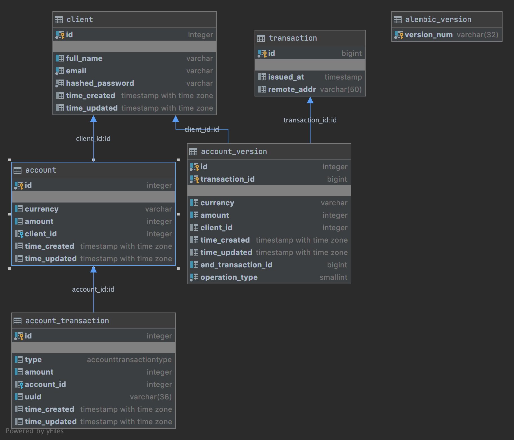

# Bin Bon Bank

Simple API implementation to create clients and 
their accounts, as well as transactions with them.

## Assignment:
It is necessary to develop a web application of a simple payment system (for simplification, all transfers and crediting without commission). 

### Requirements:
1) Each client in the system has one "account" containing funds.
2) Information about the wallet and its balance is stored.
3) Clients can make money transfers to each other.
4) The information about all transactions in the client's purse is stored.
5) The project is an HTTP API containing the main "account" transactions:

    1) Create a client with an account;
    2) Crediting the client's purse;
    3) money transfer from one account to another.
    6) The whole project, with all dependencies, must be deployed by the team
    docker-compose up.

## Run it

Run the application:

```bash
// Run the application
$ docker-compose up

INFO:     Application startup complete.

// It works! 🎉

// Open swagger panel to explore the API
```

- Swagger panel http://localhost/docs

## Simple using pipeline

- Open the swagger panel http://localhost/docs
- Create an client `/api/v1/clients/` `[POST]`
- Authorize `[POST]`
- Create a new account for the client `/api/v1/accounts/` `[POST]`
- Add money to the accout `/api/v1/accounts/deposit` `[POST]`

## Testing

To test the backend run:

```
$ DOMAIN=backend sh ./app/scripts/test.sh
```

The tests run with Pytest, modify and add tests to `./app/app/tests/`.

### Local tests

Start the stack with this command:

```
DOMAIN=backend sh ./app/scripts/test-local.sh
```

## DataBase
- Postgres 12

### DataBase UML representation
[]()

### Versioning data in tables.

I've implemented the SQLAlchemy-Continuum extension because 
I need support versioning entire transactions and
the default sqlalchemy мersioning is very limited.

### Integrity and consistency

When all operations under a transaction completed, then use commit
to persist the changes in the database to maintain the data integrity and consistency.

## Docker Compose files and env vars

There is a main docker-compose.yml file with all the 
configurations that apply to the whole stack, it is used 
automatically by docker-compose.

The Docker Compose file use the .env file containing 
configuration to be injected as environment variables in the container.
